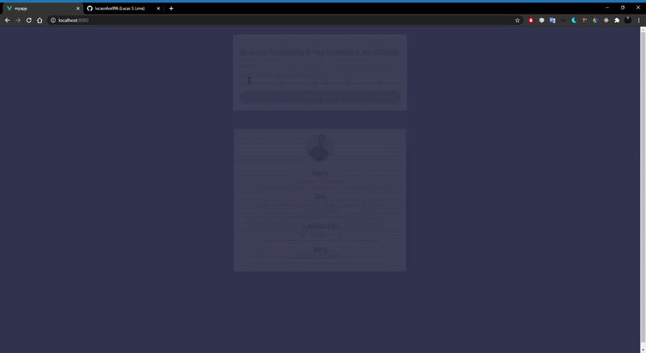

# Projeto para consulta de usuários e repositórios existentes no GitHub em VueJs.

Esse projeto foi desenvolvido com a ideia de demonstrar de uma forma simples o consumo de uma API com <b>VueJs</b>.

A idéia central desse projeto é fazer com que o usuário consiga pesquisar outros usuários do GitHub e seus respectivos repositórios de uma forma rápida e mais simples.

# API's utilizadas do GitHub
<h3>API para consultar usuários</h3>
https://api.github.com/users/${name}
[name] = Nome de usuário do GitHub, por exemplo (guscarpim).

<h3>API para consultar repositórios</h3>
https://api.github.com/users/${name}/repos
[name] = Nome de usuário do GitHub.
/repos = Caminho indicado para buscar os repositórios do usuário digitado.

## Iniciar o Projeto

<b>1º Baixe o Vue Cli na sua máquina com o comando (npm install -g @vue/cli) || (yarn global add @vue/cli).</b>

<b>2º Clone esse repositório no seu computador ou baixe no formato (ZIP).</b>

<b>3º Abra o projeto em seu editor de texto favorito.</b>

<b>4º Rode o comando "NPM INSTALL" || "YARN" para baixar todas as depêndencias do projeto.</b>

<b>5º Rode o comando "NPM RUN SERVE" || "YARN SERVE" para inicializar o projeto, em seguida, vá até o endereço padrão do Vue "http://localhost:8080/"</b>

# Desenvolvido por Gustavo Scarpim:

